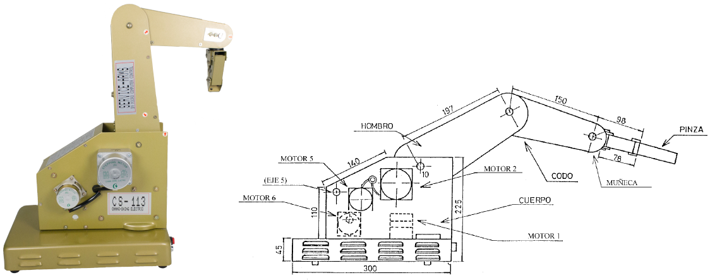
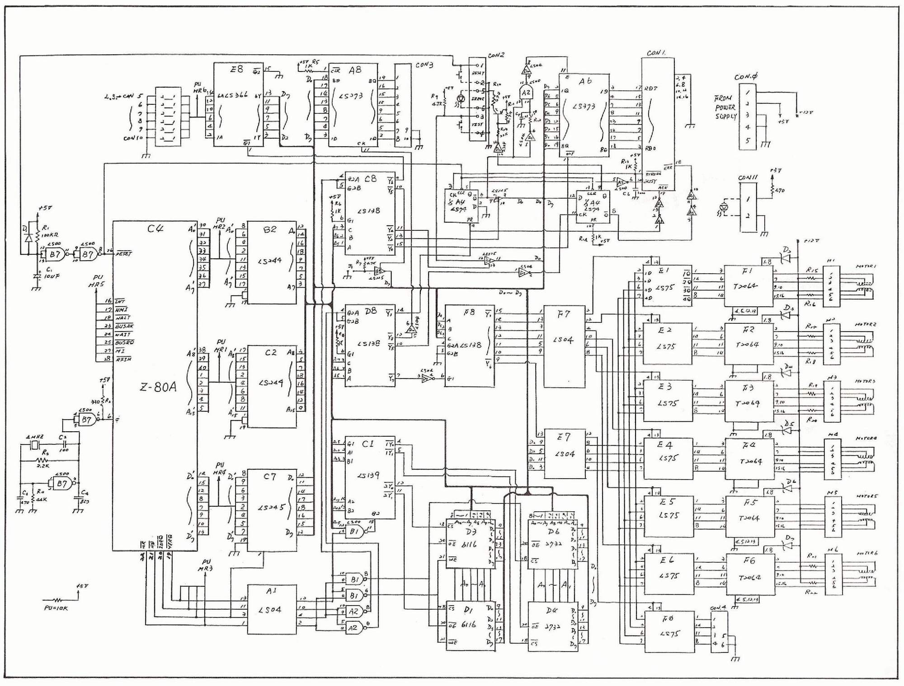
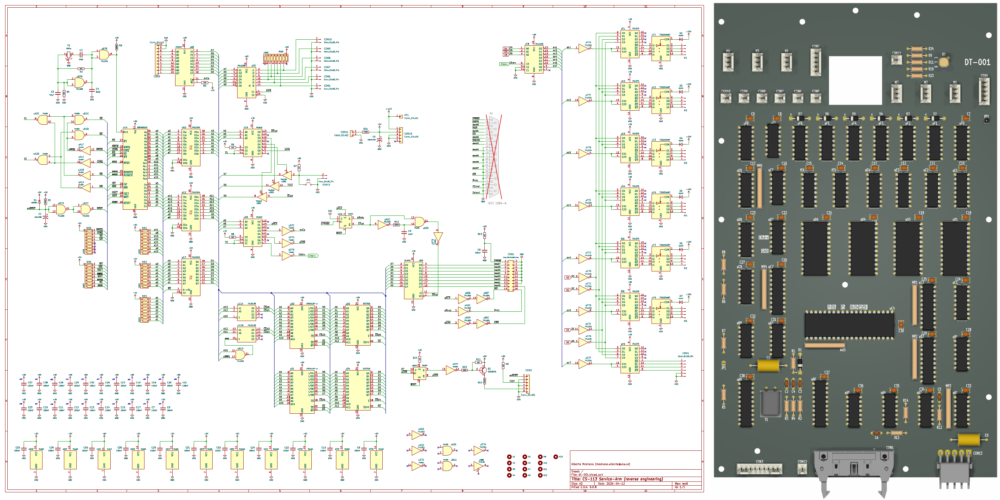

# Modernización del Manipulador Robótico CS-113 / RS-2200 Pro-Arm

Este proyecto tiene como objetivo la recuperación y actualización tecnológica de los brazos robóticos CS-113 (RS-2200 Pro-Arm) pertenecientes a la [Universidad de Los Andes (ULA)](http://ula.ve/). Mediante el estudio del esquema original y la migración a herramientas modernas como [KiCad EDA](https://www.kicad.org/), se ha diseñado un método para interceptar el bus de control original y sustituir el microprocesador [Zilog Z80](https://www.zilog.com/docs/z80/um0080.pdf) por [microcontroladores](https://es.wikipedia.org/wiki/Microcontrolador)/[SoC](https://es.wikipedia.org/wiki/Sistema_en_un_chip) de nueva generación.



## Descripción del Proyecto

Los manipuladores robóticos CS-113 fueron equipos estándar en laboratorios de robótica, pero su dependencia del [puerto paralelo (LPT)](https://es.wikipedia.org/wiki/Puerto_paralelo) y del microprocesador Z80 los hace difícilmente integrables en entornos actuales.

Este desarrollo propone:

- Ingeniería Inversa: Estudio del esquema original de la placa rotulada como DT-001.
- Migración CAD: Reconstrucción del esquema en KiCad EDA para facilitar el análisis de interconexiones.
- Intercepción de Bus: Remoción de los ICs [Zilog Z80](https://www.zilog.com/docs/z80/um0080.pdf) (C4 renombrado como uC4) y [74LS04](https://www.ti.com/lit/ds/symlink/sn74ls04.pdf) (D7 renombrado como uD7) para inyectar señales de control desde un controlador externo.
- Control Moderno: Uso de una tarjeta [MikroElectronika EasyPIC6](https://www.microchip.com/en-us/development-tool/tmik003) actualizada con un microcontrolador [Microchip PIC18F46K40](https://www.microchip.com/en-us/product/pic18f46k40).

## Esquemas

La [placa base](https://es.wikipedia.org/wiki/Circuito_impreso) del manipulador se encuentra ubicada por la parte inferior del mismo.

### Esquema original

El circuito disponible en la pagina #13 del documento [RS-2200_Pro-Arm_Robotics](datasheet/RS-2200_Pro-Arm_Robotics.pdf), entre otros valores interesantes que se logran conseguir allí de éste aparato.



### Esquema migrado a KiCad EDA

El esquema migrado a una herramienta de diseño es como sigue:



## Hardware y Modificaciones

### Componentes Reutilizados (Bloque de Potencia)

La placa original utiliza una arquitectura lógica robusta que se mantiene para el manejo de los motores, para ello se requiere la comprensión de los siguientes elementos:

- [74LS245](https://www.ti.com/lit/ds/symlink/sn74ls245.pdf): Transceptores de bus octales.
- [74LS138](https://www.ti.com/lit/ds/symlink/sn74ls138.pdf): Decodificador/demultiplexor de 3 a 8 líneas.
- [74LS75](https://www.ti.com/lit/ds/symlink/sn74ls75.pdf): Latches biestables de 4 bits.
- [TD62064AP](https://mm.digikey.com/Volume0/opasdata/d220001/medias/docus/932/TD62064AP%2CAF.pdf): Drivers Darlington de alta corriente para los [motor paso a paso (Stepper)](https://es.wikipedia.org/wiki/Motor_paso_a_paso) de tipo unipolar.

Una vez consolidado ese estudio y analizando la etapa de potencia, practicamente solo se requiere el uso de lo siguiente:

- pendiente imagen aqui

### Interfaz de Conexión (DB9 Personalizado)

Se ha implementado una conexión mediante un conector DB9 macho para el control de los 6 motores de paso y funciones adicionales:

| Pin | Conexión |
| :----------- | :----------- |
| 1	| d0 |
| 2	| d1 |
| 3	| d2 |
| 4	| d3 |
| 5	| d4 |
| 6	| d5 |
| 7	| d6 |
| 8	| ENdrv |
| 9	| GND |

## Desarrollo de Software

El firmware actual está siendo desarrollado para el [PIC18F46K40](https://www.microchip.com/en-us/product/pic18f46k40) utilizando:

- [MPLAB X IDE con](https://www.microchip.com/en-us/tools-resources/develop/mplab-x-ide) compilador [XC8](https://www.microchip.com/en-us/tools-resources/develop/mplab-xc-compilers/xc8).
- [MPLAB Code Configurator (MCC)](https://www.microchip.com/en-us/tools-resources/configure/mplab-code-configurator) para la gestión de periféricos.
- Capacidad de operación autónoma, asistida o vía [USB](https://es.wikipedia.org/wiki/Universal_Serial_Bus).

## Enlaces de Interés y Referencias

Proyectos y documentación relacionada que han servido de base:

- [Repositorio Digital ULA](http://bdigital2.ula.ve:8080/xmlui/handle/654321/11944)
- [Análisis Técnico ITC](https://itc.ktu.lt/index.php/ITC/article/view/985/1054)
- [Hilo en Arduino Forum - Reconstrucción CS-113](https://forum.arduino.cc/t/reconstruccion-de-robot-cs-113/483691)
- [CS-113 Service-Arm](https://openvrg.moodlehub.com/file.php/30/cyr_0204/cyr_01/robotica/cs113.htm)
- [Hackaday.io - Robot Arm CS-113 Project](https://hackaday.io/project/168093-robot-arm-cs-113-18f4550-pic-usb-pc-controller)

Nota: Si has realizado algún intento de desarrollo con este manipulador, te invitamos a colaborar agregando tu referencia en esta sección.

## Colaboradores
- Alberto Medrano

## Instalación y Uso

Clona el repositorio:

```git clone https://github.com/ecadmaster/CS-113_Mod.git```

Consulta las datasheets para entender los límites operativos de los integrados.

## Contribuciones y Licencia
Este proyecto está bajo la licencia MIT. Las sugerencias de mejora para el entorno académico de la Escuela de Ingeniería Eléctrica son bienvenidas.
